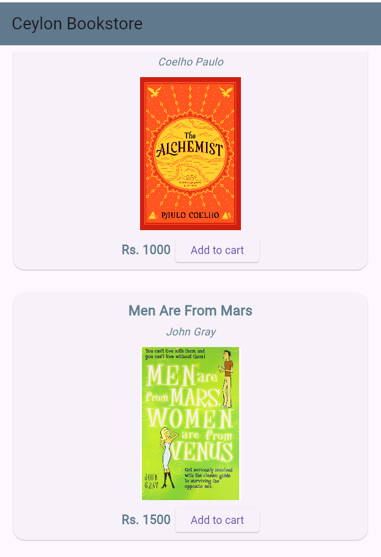
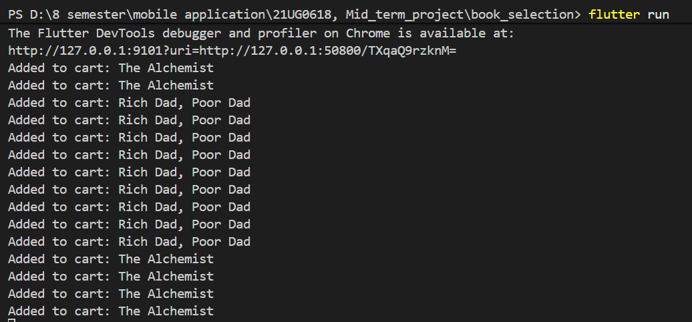

# Ceylon Bookstore 📚

A modern, elegant Flutter mobile application prototype for browsing and selecting books. This is a mid-term project that demonstrates clean UI/UX principles, structured component-based architecture, and modern Flutter development practices.

## ✨ Features

- **Modern UI/UX**: Clean, minimalist layout with soft shadows, rounded corners, and a balanced color palette.
- **Book Catalog**: A scrollable list of books featuring:
  - High-quality cover images
  - Book title and author information
  - Clear pricing
  - Integrated "Add to Cart" interactions
- **Modular Components**: Uses custom reusable Flutter widgets to ensure a clean codebase.

## 📱 Screenshots / Layout

The application features a single-screen layout with a clean navigation bar and a vertical scroll list of book cards. Each card uses a horizontal layout, optimizing space and reading comfort.

<div align="center">
  
  &nbsp;&nbsp;&nbsp;
  
</div>

## 🛠️ Tech Stack

- **Framework**: [Flutter](https://flutter.dev/) (SDK ^3.5.4)
- **Language**: [Dart](https://dart.dev/)
- **Design System**: Custom styling heavily inspired by Modern Material principles.

## 📂 Project Structure

```text
book_selection/
├── assets/
│   └── images/              # Local book cover assets
├── lib/
│   ├── screens/
│   │   └── book_list.dart   # Main screen containing the catalog list
│   ├── widgets/
│   │   └── book.dart        # Reusable modern card widget for each book
│   └── main.dart            # Application entry point and Theme configuration
├── pubspec.yaml             # Dependencies and asset declarations
└── README.md
```

## 🚀 Getting Started

Follow these steps to run the application on your local machine.

### Prerequisites

- [Flutter SDK](https://docs.flutter.dev/get-started/install) installed on your machine.
- An IDE with Flutter plugins configured (e.g., VS Code, Android Studio).
- A running emulator, simulator, or connected physical device.

### Installation

1. **Clone the repository** (if you haven't already):
   ```bash
   git clone <your-repo-url>
   cd book_selection
   ```

2. **Fetch dependencies**:
   Run the following command in the terminal to get all the required packages:
   ```bash
   flutter pub get
   ```

3. **Run the app**:
   Start the application on your connected device/emulator:
   ```bash
   flutter run
   ```

## 🎨 Theme & Styling

The app utilizes a centralized `ThemeData` configuration in `main.dart` with:
- **Primary Accent**: Indigo (`Color(0xFF4F46E5)`)
- **Background**: Soft Gray (`Color(0xFFF5F7FA)`)
- **Typography**: Clean, bold headers with subtle, readable secondary text styling.

---
*Created as a Mobile Application Mid-Term Project.*